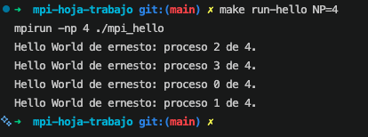
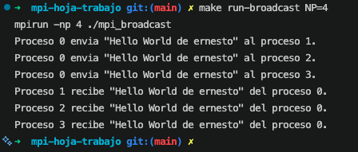
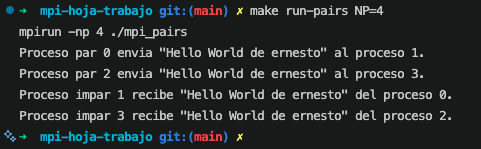
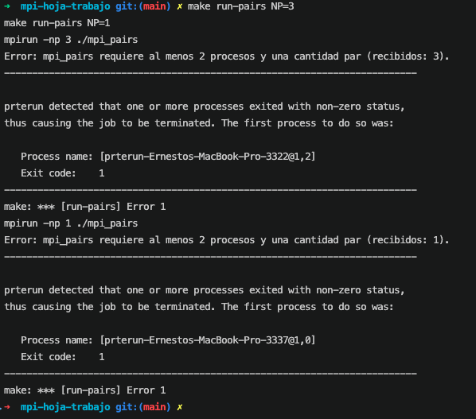

# Hoja de trabajo: comunicación con MPI

Repositorio: https://github.com/AscencioSIUU/computacionParalelaYDistribuida

Carpeta: `exercises/mpi-hoja-trabajo`

Este ejercicio conserva tres programas independientes para mostrar la evolución
solicitada: iniciar MPI, enviar un saludo desde el proceso 0 y, finalmente,
comunicar procesos en parejas par/impar. El saludo incluye `Ernesto` de forma
predeterminada y puede personalizarse al compilar.

## Inciso 1: estructura básica (mpiHello.c)

`mpi_hello.c` inicializa el entorno, consulta el identificador del proceso
(`rank`) y el número total de procesos, imprime el saludo y finaliza MPI:

```c
MPI_Init(&argc, &argv);
MPI_Comm_rank(MPI_COMM_WORLD, &rank);
MPI_Comm_size(MPI_COMM_WORLD, &process_count);
printf("Hello World de %s: proceso %d de %d.\n",
       STUDENT_NAME, rank, process_count);
MPI_Finalize();
```

Ejecutar con cuatro procesos:

```bash
make run-hello NP=4
```



**Se observa:** cuatro saludos, uno por cada `rank` (0 a 3), cada uno con el
total de procesos (`de 4`). El orden de las líneas cambia entre ejecuciones
porque los cuatro procesos corren de forma concurrente e imprimen sin
sincronizarse entre sí.

## Inciso 2: intercambio de mensajes punto a punto (envío desde el proceso 0)

`mpi_broadcast.c` implementa la difusión manual pedida en el inciso 4, sin usar
`MPI_Bcast`. El proceso 0 recorre los demás rangos y hace un envío punto a
punto; cada proceso restante publica una recepción correspondiente:

```c
if (rank == 0) {
    for (int destination = 1; destination < process_count; ++destination) {
        MPI_Send(MESSAGE, sizeof(MESSAGE), MPI_CHAR, destination,
                 MESSAGE_TAG, MPI_COMM_WORLD);
    }
} else {
    MPI_Recv(received_message, sizeof(received_message), MPI_CHAR, 0,
             MESSAGE_TAG, MPI_COMM_WORLD, MPI_STATUS_IGNORE);
}
```

Ejecutar:

```bash
make run-broadcast NP=4
```



**Se observa:** el proceso 0 envía el mensaje tres veces, una por cada
destinatario (1, 2 y 3), y cada uno de esos tres procesos imprime su propia
recepción. Hay correspondencia exacta entre los `MPI_Send` del proceso 0 y los
`MPI_Recv` de los demás: mismo tag (`MESSAGE_TAG`) y mismo comunicador.

## Inciso 3: mensajes con bloqueo y correspondencia (parejas pares/impares)

El inciso 5 pide cambiar `if (rank == 0)` por `if (rank % 2 == 0)` y que cada
proceso par envíe a `rank + 1` en vez de iterar sobre todos los destinos. Al
hacer ese cambio sin ajustar también el lado de la recepción, cada proceso
impar se queda esperando un `MPI_Recv` que nadie le envía (todos los pares
excepto el 0 nunca reciben una llamada `MPI_Send` dirigida a ellos), y el
programa se bloquea — el comportamiento que el inciso 5d pide observar.

La corrección (`mpi_pairs.c`) hace que el proceso impar reciba exclusivamente
desde `rank - 1`, para que cada `MPI_Send` tenga un único `MPI_Recv` en
correspondencia:

```c
if (rank % 2 == 0) {
    MPI_Send(MESSAGE, sizeof(MESSAGE), MPI_CHAR, rank + 1,
             MESSAGE_TAG, MPI_COMM_WORLD);
} else {
    MPI_Recv(received_message, sizeof(received_message), MPI_CHAR, rank - 1,
             MESSAGE_TAG, MPI_COMM_WORLD, MPI_STATUS_IGNORE);
}
```

Ejecutar:

```bash
make run-pairs NP=4
```



**Se observa:** exactamente dos envíos y dos recepciones — la pareja 0→1 y la
pareja 2→3. Cada `MPI_Send` tiene un único `MPI_Recv` con el mismo
origen/destino, tag y comunicador, así que ningún proceso queda esperando una
comunicación inexistente.

```bash
make run-pairs NP=3
make run-pairs NP=1
```



**Se observa:** en ambos casos el proceso 0 imprime el mensaje de error
(`requiere al menos 2 procesos y una cantidad par`), todos los procesos llaman
a `MPI_Finalize` y el programa termina con estado de fallo; `mpirun` añade su
propio resumen indicando que uno o más procesos devolvieron un código distinto
de cero.
